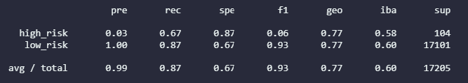
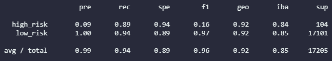
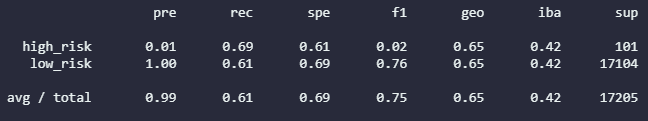
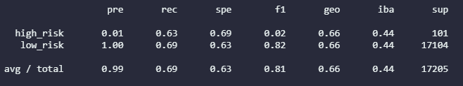
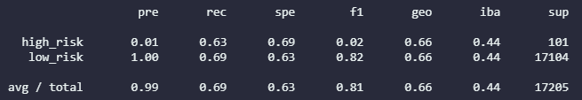
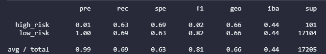

# Credit_Risk_Analysis
## Project Summary

### Tools
-

## Results
### Balanced Random Forest Classifier

- Accuracy Score: 0.79
- Precision: 0.99
- Recall: 0.70
- F1: 0.93

### Easy Ensemble AdaBoost Classifier

- Accuracy Score: 0.91
- Precision: 0.99
- Recall: 0.89
- F1: 0.96

### Logistic Regression

- Accuracy Score: 0.65
- Precision: 0.99
- Recall: 0.55
- F1: 0.71

### SMOTEENN Over/Under Sampling

- Accuracy Score: 0.649
- Precision: 0.99
- Recall: 0.60
- F1: 0.81
 

### SMOTE Oversampling

- Accuracy Score: 0.646
- Precision: 0.99
- Recall: 0.69
- F1: 0.81

### ClusterCentroids and Undersampling

- Accuracy Score: 0.544
- Precision: 0.99
- Recall: 0.69
- F1: 0.56

